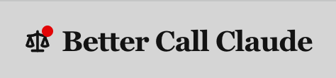

[](https://github.com/fedec65/bettercallclaude/releases)
[](LICENSE)
[](https://claude.ai)
[](https://bettercallclaude.ch)
[](https://mcp.bettercallclaude.ch/health)
[](https://buymeacoffee.com/federicocesconi)

<p align="center">
  
</p>

<p align="center"><strong>Swiss Legal Intelligence Plugin for Cowork Desktop</strong></p>

BetterCallClaude transforms legal research, case strategy, and document drafting for Swiss lawyers. It provides deep integration with Swiss legal databases, multi-lingual analysis (DE/FR/IT/EN), and built-in Anwaltsgeheimnis (attorney-client privilege) protection -- 20 agents, 19 commands, 14 skills, and 9 MCP servers covering BGE/ATF/DTF precedent research, litigation strategy, adversarial analysis, legal drafting, citation verification, document intelligence, and CAS/TAS sports arbitration across all 26 Swiss cantons.

> **Claude Code CLI users**: this repository is Cowork Desktop only. The CLI version is at [fedec65/bettercallclaude-cli](https://github.com/fedec65/bettercallclaude-cli).

---

## Overview

BetterCallClaude provides a structured methodology for handling legal work with AI assistance. The framework consists of five interconnected phases.


---

## What's New in v4.5.0

**v4.5.0 — Skill descriptions v2 + content fixes.** All 14 skill descriptions rewritten with richer trigger semantics so Cowork's auto-router activates the right skill more accurately. Three concrete content bugs flagged by Devin Review fixed. No changes to MCP servers, agent logic, or skill bodies.

- **Skill descriptions v2** — every skill's `description:` frontmatter now lists concrete trigger conditions, MCP tool names by name, and explicit `Do NOT trigger for:` boundaries with cross-references to other skills. Description sizes grew from short summaries (~300 chars) to 1.5K–2.4K chars each, giving Cowork's skill router much more signal. Example: `swiss-legal-research` description now names 5 MCPs and 14 tools and rules out citation-only / refinement-only / drafting-only / translation-only queries. Skill bodies are unchanged — logic and workflows are identical to 4.4.0.
- **Briefing agent reorganised** — same workflow + agent panel structure, more concise phrasing (net −5 lines).
- **`/legal` and `/briefing` intent-classification** — routing fixes between the briefing and jurisdiction skills.
- **Fixed: DLT-Gesetz SR attribution.** `compliance-frameworks` skill incorrectly attributed SR 950.1 to the DLT Act in 3 places. SR 950.1 is FIDLEG; the DLT Act is a Mantelerlass (AS 2021 33) with no own SR number, amending OR/FinfraG/BankG/GwG. Fix prevents `fedlex-sparql.get_article` lookups from returning the wrong statute.
- **Fixed: `/legal` complexity threshold metadata.** Description claimed briefing activates at complexity ≥ 5; actual body has three tiers (1–3 no briefing, 4–6 inline questions, 7–10 legal-briefing skill). Description aligned with body.
- **Fixed: `legal-query-refinement` handoff metadata.** Description and body had a 2-tier gap (5–7) where description said don't activate but body had no handoff. Description aligned with body's actual condition (`≥ 8 OR 3+ legal domains OR multi-jurisdictional`).
- **Fixed: `/version` and `/help` hardcoded version display** — was stale at `4.3.0` even on 4.4.0 installs; now shows the running version.
- **Removed: dev artifacts shipped in 4.4.0.** The plugin no longer ships `legal-briefing-workspace/` (a ~150 KB / 55-file eval harness with iteration-1 / evals / benchmark JSON runs) or two ad-hoc HTML review exports. `.gitignore` extended to prevent recurrence.

**Content counts**: 20 agents, 19 commands, 14 skills, 9 MCP servers in `.mcp.json` (7 remote HTTP on `mcp.bettercallclaude.ch` + `swiss-caselaw` SSE on `mcp.opencaselaw.ch` + `ollama` local STDIO) — unchanged from 4.4.0.

[Full changelog →](CHANGELOG.md)

**Cowork Desktop dedicated release** -- This repository is exclusively for Claude Cowork Desktop. The Claude Code CLI version is at [fedec65/bettercallclaude-cli](https://github.com/fedec65/bettercallclaude-cli).

- **HTTP-only transport**: 8 of 9 MCP servers connect via `mcp.bettercallclaude.ch` / `mcp.opencaselaw.ch` -- no local Node.js build required for those
- **Local STDIO server** (`ollama`): bundled and only touches `http://localhost:11434` for privacy-routed translation/summarisation
- **Simplified setup**: `/setup` checks connectivity only -- no transport switching needed in Cowork

---

## Installation

> **Full installation guide with screenshots:** [BetterCallClaude Tutorial →](https://github.com/fedec65/bettercallclaude_tutorial)

1. In Cowork, click **Customize** > **Browse plugins** > **Personal** > **+** > **Add marketplace from GitHub**
2. Enter `fedec65/bettercallclaude` and click **Sync**
3. Click **Install** on the BetterCallClaude card

MCP servers connect automatically via HTTP. No Node.js, no local setup, no API keys required.

---

## Commands

| Command | Description |
|---------|-------------|
| `/bettercallclaude:legal` | Intelligent gateway -- analyzes intent, routes to the appropriate specialist agent, and manages multi-step legal workflows. Use `--refine` to transform vague queries first. |
| `/bettercallclaude:refine` | Transform vague legal queries into structured prompts through Socratic dialogue. Recommends optimal workflows and introduces Swiss legal terminology. |
| `/bettercallclaude:research` | Search Swiss legal precedents and compile research memoranda. Supports BGE/ATF/DTF databases, doctrine references, and cross-jurisdictional analysis. |
| `/bettercallclaude:strategy` | Develop litigation strategy with risk assessment, cost-benefit analysis, and procedural pathway evaluation. |
| `/bettercallclaude:draft` | Draft Swiss legal documents including contracts, court briefs, legal opinions, and memoranda with proper citation formatting. |
| `/bettercallclaude:cite` | Verify and format Swiss legal citations across all four national languages (BGE/ATF/DTF formats). |
| `/bettercallclaude:validate` | Validate Swiss legal citations in bulk -- check format, existence, and cross-language consistency. |
| `/bettercallclaude:precedent` | Search and analyze BGE/ATF/DTF precedents with precedent chain tracking and evolution analysis. |
| `/bettercallclaude:federal` | Analyze a legal question under federal Swiss law (ZGB, OR, StGB, BV, and related federal statutes). |
| `/bettercallclaude:cantonal` | Analyze a legal question under cantonal law for a specific canton. |
| `/bettercallclaude:adversarial` | Run three-agent adversarial analysis -- advocate builds the case, adversary challenges it, judicial analyst synthesizes. |
| `/bettercallclaude:briefing` | Structured pre-execution briefing -- assembles a specialist panel, collects case context, and builds an execution plan before agents start working. |
| `/bettercallclaude:workflow` | Define and execute multi-agent legal workflows (due diligence, litigation prep, contract lifecycle, real estate closing). |
| `/bettercallclaude:translate` | Translate Swiss legal documents between DE, FR, IT, and EN while preserving legal terminology precision. |
| `/bettercallclaude:doc-analyze` | Analyze Swiss legal documents -- identify legal issues, extract key clauses, verify citations, assess compliance. |
| `/bettercallclaude:summarize` | Consolidate multi-agent pipeline output -- deduplicate disclaimers, terminology, and citations with length control (`--short`/`--medium`/`--long`). |
| `/bettercallclaude:setup` | Check MCP server connectivity and display status for all 9 servers. |
| `/bettercallclaude:version` | Display plugin version, installed components, and system status. |
| `/bettercallclaude:help` | Show complete command reference, available agents, skills, and usage examples. |

### Usage Examples

```
/bettercallclaude:legal I need to assess our exposure under Art. 97 OR for late delivery

/bettercallclaude:refine I have problems with my landlord

/bettercallclaude:research Art. 97 OR contractual liability for late delivery

/bettercallclaude:strategy Commercial lease dispute in Zurich, landlord claims CHF 200k damages

/bettercallclaude:draft Employment contract for a software engineer in Geneva, bilingual DE/FR

/bettercallclaude:adversarial Is the non-compete clause in this employment contract enforceable?

/bettercallclaude:workflow litigation-prep Personal injury claim against manufacturer

/bettercallclaude:briefing Prepare full litigation for Art. 97 OR breach, CHF 500K, Zurich

/bettercallclaude:cantonal ZH Commercial court jurisdiction for contract disputes over CHF 30k

/bettercallclaude:doc-analyze @contract.pdf Review this commercial lease agreement
```

---

## Key Features

- **Briefing sessions** -- Complex queries trigger a collaborative intake phase with specialist panels, targeted questions, and structured execution plans before agents start working. Supports `--resume` for cross-session persistence.
- **Adversarial analysis** -- Three-agent workflow: advocate builds the case, adversary challenges it, judicial analyst synthesizes using Swiss Erwagung methodology with probability scores.
- **Multi-agent workflows** -- Predefined pipelines for due diligence, litigation prep, contract lifecycle, and real estate closings.
- **All 26 cantons** -- Full cantonal coverage with court systems, citation formats, and MCP search via entscheidsuche.ch. Federal law is the default; mentioning a canton triggers cantonal mode.
- **Multi-language** -- Automatic language detection for DE/FR/IT/EN with correct legal terminology and citation formats.

---

## MCP Servers

All servers connect automatically after installation. No configuration required.

| Server | Purpose | Transport |
|--------|---------|-----------|
| `entscheidsuche` | Swiss court decision search (Bundesgericht + cantonal) | HTTP |
| `bge-search` | Federal Supreme Court decision search | HTTP |
| `legal-citations` | Citation verification and formatting | HTTP |
| `fedlex-sparql` | Federal legislation database (SPARQL) | HTTP |
| `onlinekommentar` | Swiss legal commentaries | HTTP |
| `legal-persona` | Swiss-law document intelligence (strategy, drafting, analysis) | HTTP |
| `tas-jurisprudence` | CAS/TAS sports arbitration decisions | HTTP |
| `swiss-caselaw` | Case law, citation graphs, appeal chains (opencaselaw.ch) | SSE |
| `ollama` | Local privacy classification for Anwaltsgeheimnis | Local |

The seven HTTP servers connect to `https://mcp.bettercallclaude.ch` (rate limit: 60 req/min per IP). The `swiss-caselaw` server connects to `https://mcp.opencaselaw.ch`. No API keys required for any server.

See [CONNECTORS.md](bettercallclaude/CONNECTORS.md) for detailed API documentation.

---

## Privacy

BetterCallClaude includes built-in Anwaltsgeheimnis (attorney-client privilege, Art. 321 StGB) compliance. A `PreToolUse` hook scans outgoing tool calls for privilege indicators in German (Anwaltsgeheimnis, Mandantengeheimnis, vertraulich), French (secret professionnel, confidentiel), and Italian (segreto professionale, confidenziale).

| Mode | Behavior |
|------|----------|
| `strict` | All external calls require confirmation. Local processing preferred via Ollama. |
| `balanced` | Privileged content triggers confirmation. Non-privileged content processed normally. |
| `cloud` | Standard cloud processing with privacy hook active for explicit privilege markers only. |

---

## Language Support

| Language | Code | Legal Context |
|----------|------|---------------|
| German | DE | Primary: ZGB, OR, StGB, BGE. Used in ZH, BE, BS, and German-speaking cantons. |
| French | FR | Official: CC, CO, CP, ATF. Used in GE, VD, and French-speaking cantons. |
| Italian | IT | Official: CC, CO, CP, DTF. Used in TI and Italian-speaking regions. |
| English | EN | Working language with Swiss legal term mapping. |

---

## Requirements

- Claude Cowork Desktop (latest version)
- Node.js >= 18 (for the ollama privacy classifier only -- all other servers connect via HTTP)

---

## CLI Version

Prefer working from the terminal? **[BetterCallClaude CLI](https://github.com/fedec65/bettercallclaude-cli)** is the Claude Code CLI edition with local stdio MCP transport, configurable HTTP fallback, and the same 20 agents, 19 commands, and 14 skills.

---

## Author

Federico Cesconi -- [fedec65/bettercallclaude](https://github.com/fedec65/bettercallclaude) -- [bettercallclaude.ch](https://bettercallclaude.ch)

## License

AGPL-3.0 -- See [LICENSE](LICENSE) for full terms.

[Support the project](https://buymeacoffee.com/federicocesconi)

---

## For Developers

This repo contains the plugin only (agents, commands, skills, hooks, `.mcp.json`, and the bundled `ollama` local STDIO server). MCP server source code and the HTTP aggregator deployed to Railway at `mcp.bettercallclaude.ch` live in the separate [`fedec65/BetterCallClaudeMCP`](https://github.com/fedec65/BetterCallClaudeMCP) repo.

```bash
npm run package        # Create distributable plugin zip
```

To change an MCP server's behaviour, open a PR in
[`fedec65/BetterCallClaudeMCP`](https://github.com/fedec65/BetterCallClaudeMCP).
Railway auto-redeploys on merge to `main`.

See [CONNECTORS.md](bettercallclaude/CONNECTORS.md) for MCP server API documentation and [CONTRIBUTING.md](CONTRIBUTING.md) for the full contributor workflow.

---

## Professional Disclaimer

BetterCallClaude is a legal research and analysis tool. All outputs produced by this plugin:

- Require professional lawyer review and validation before use.
- Do not constitute legal advice.
- May contain errors, omissions, or outdated information.
- Must be verified against official sources (admin.ch, court databases, official gazettes).
- Must be adapted to the specific circumstances of each case.

Lawyers maintain full professional responsibility for all legal work products. This tool assists legal professionals but does not replace professional judgment, independent verification, or the duty of care owed to clients.
