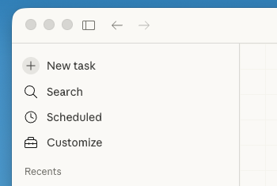
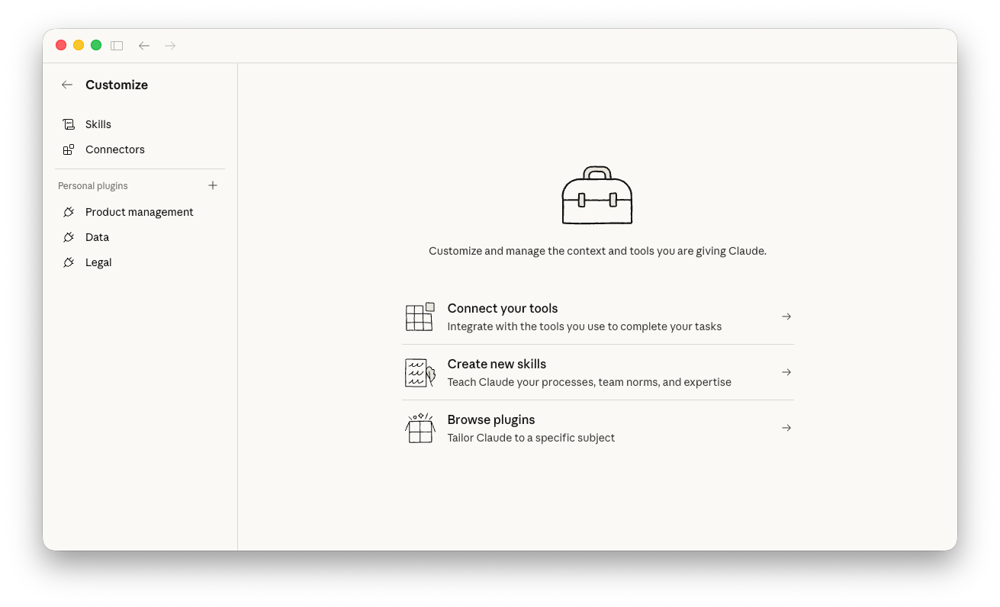
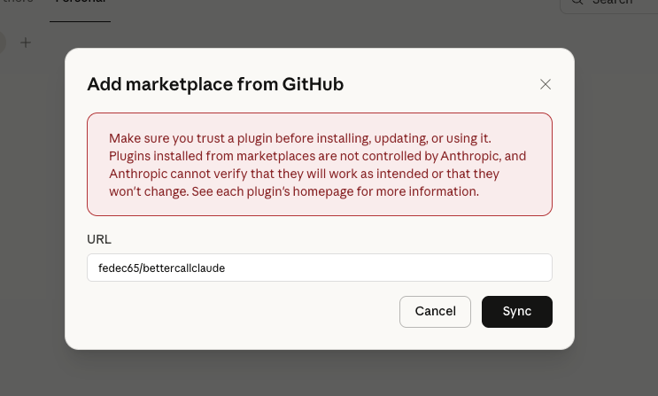
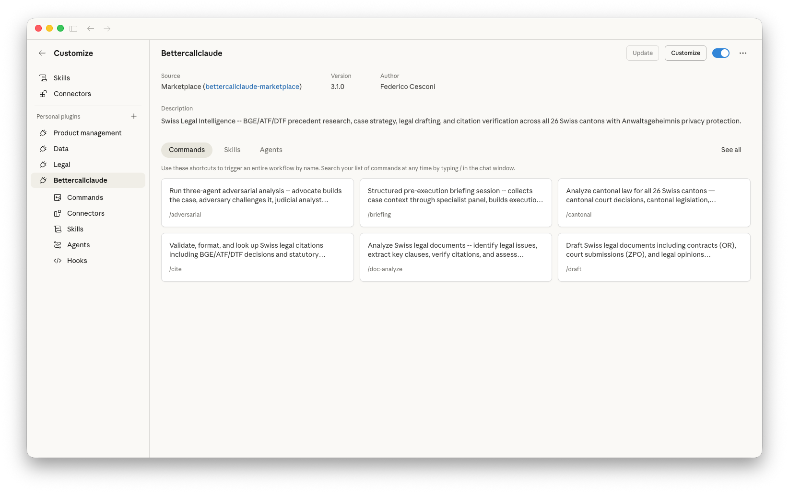
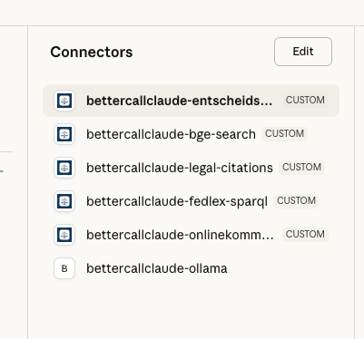
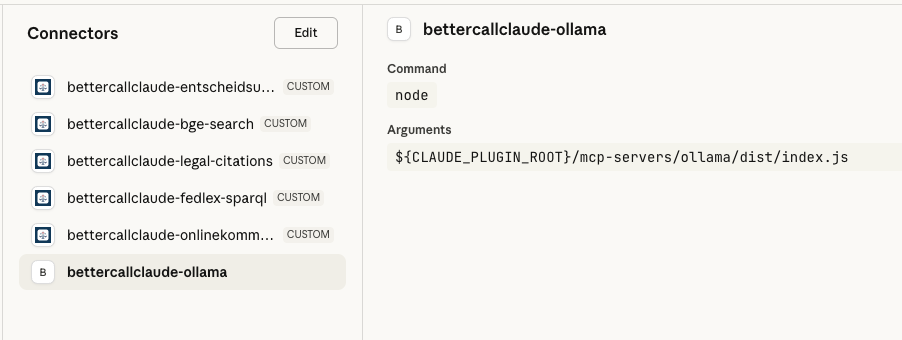

# Setting Up BetterCallClaude in Claude Cowork

This guide walks you through installing BetterCallClaude in Claude Cowork (Desktop) using the GUI. The entire process takes about two minutes.

## Prerequisites

- Claude Desktop with Cowork access (Max plan)

## Step-by-Step Installation

### 1. Open Cowork


Open Claude Desktop and switch to the **Cowork** tab.

### 2. Open Customize



Click **CUSTOMIZE** in the top-left corner of the sidebar.

### 3. Browse Plugins



Click **Browse plugins** at the bottom of the Customize panel.

### 4. Switch to Personal Tab


Click the **PERSONAL** tab (not "By Anthropic & Partners").

### 5. Add a New Marketplace


Click the **+** button next to "Local uploads".

### 6. Select "Add Marketplace from GitHub"


Choose **ADD MARKETPLACE FROM GITHUB** from the dropdown.

### 7. Enter Repository and Sync



Type `fedec65/bettercallclaude` and click **Sync**.

### 8. Install the Plugin


Click **Install** on the BetterCallClaude plugin card.

### 9. Accept MCP Servers


A dialog lists the MCP servers the plugin will configure. Only `bettercallclaude-ollama` runs locally (for privacy classification) -- the other five connect via HTTP to hosted servers. Click **Continue**.

### 10. Verify Installation


The plugin is now installed. Click **Manage** to explore commands, skills, and agents.

---

## Verifying MCP Connectors

### 11. Open Connectors



In the plugin detail view, click **Connectors** in the left sidebar.

### 12. Check All 6 Connectors



Verify that all 6 connectors are listed:

- **bettercallclaude-entscheidsuche** (CUSTOM) -- Swiss court decision search
- **bettercallclaude-bge-search** (CUSTOM) -- Federal Supreme Court decisions
- **bettercallclaude-legal-citations** (CUSTOM) -- Citation verification
- **bettercallclaude-fedlex-sparql** (CUSTOM) -- Federal legislation database
- **bettercallclaude-onlinekommentar** (CUSTOM) -- Legal commentaries
- **bettercallclaude-ollama** -- Local privacy classification

### 13. Set Tool Permissions


Click each connector and ensure **Always allow** is set for its tools. This lets BetterCallClaude query Swiss Confederation databases without prompting for permission on every request.

### 14. Ollama (Optional)



The ollama connector runs locally via stdio. If you have [Ollama](https://ollama.com) installed on your computer, the privacy classifier is available for Anwaltsgeheimnis (attorney-client privilege) detection. If you don't have Ollama, this connector shows as disconnected -- that's fine, BetterCallClaude works fully without it.

---

## You're Ready!

Start a new Cowork task and try a command:

```
/bettercallclaude:legal What are the requirements for a valid non-compete clause under Art. 340 OR?

/bettercallclaude:research Art. 97 OR contractual liability precedents

/bettercallclaude:help
```

## Troubleshooting

| Problem | Solution |
|---------|----------|
| GitHub sync fails in the GUI | Use the terminal instead: open Cowork's built-in terminal and run `claude plugin marketplace add fedec65/bettercallclaude` |
| Connectors not showing after install | Restart Cowork |
| MCP servers not responding | Run `/bettercallclaude:setup` to check server health |
| Want to use local servers instead of HTTP | Run `/bettercallclaude:setup --local` (requires Node.js 18+) |

For the full installation guide (CLI, Windows, team setup, developer install), see [INSTALL.md](INSTALL.md).
